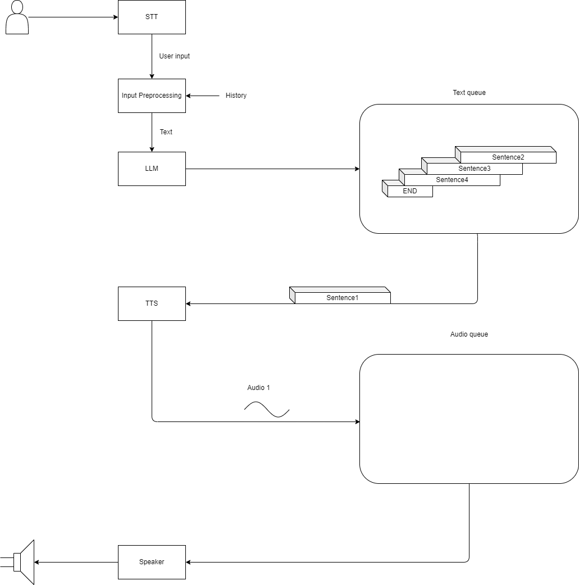

# Asynchronous AudioChat
异步语音对话组件。

一般情况下，我们获得语音回复之前，是需要LLM给出完整的回复之后，再把其转换成语音。

此组件实现如下功能：
1. STT模块接收用户的语音输入，并返回转录好的文本。
2. 对LLM的输出做实时处理：若输出了完整的一句话，则把这个句子放入到一个Text queue队列中。如果LLM推理结束，则往Text queue队列中放入一个结束标志符号END。
3. TTS模块从Text queue队列中依次拿出sentence，并把其转换成音频，然后存储在一个Audio queue队列中。如果拿到结束标志符号END，则把这个符号放到Audio queue队列中。
4. Audio queue队列被不停的拿出音频，进行播放，直到拿到结束标志符号END，至此，一次语音对话完毕。



## 技术栈


## 快速开始
首先，你需要在`src`文件夹中创建`config.json`文件并填写如下信息：
```json
{
    "lingji_key": "sk-xxx",            // 阿里云的灵积语音服务的api key                             
    "llm_url": "192.168.65.254:62707", // 模型的url，这里需要是使用Ollama部署的模型
    "model_name": "qwen2:0.5b",        // 模型的名称
    "zijie_tts_app_id": "xxx",         // 字节跳动的火山引擎的语音合成服务的app id
    "zijie_tts_access_token": "xxx"    // 字节跳动的火山引擎的语音合成服务的access token
}
```
最后，你需要使用python 3.11 来安装依赖，并运行服务：
```bash
pip install -r requirements.txt
python src/AsyncAudioChat.py
```
## 模块设计规范
这里给出各个模块的设计标准，以便使用不同的云服务或本地服务。
### STT
```python
class STT:
    def __init__(self, stt_api, *args, **kwargs):
        self.stt_api = stt_api
        self.args_for_run = args
        self.kwargs_for_run = kwargs

    def run(self):
        '''STT模块接收用户的语音输入，并保存转录好的文本。'''
        return self.stt_api(*(self.args_for_run), **(self.kwargs_for_run))
```
### InputProcessing
```python
class InputProcess:
    def __init__(self, user_input, history, *args, **kwargs):
        self.user_input = user_input
        self.history = history
    
    def run(self, *args, **kwargs):
        return self._run(*args, **kwargs)
    
    def _run(self, *args, **kwargs):
        final_input = ""
        for item in self.history:
            final_input += "User: {}\n Assistant: {}\n".format(item[0], item[1])
        return final_input + "User: {}".format(self.user_input)
```

### LLM
```python
class LLM:
    def __init__(self, text_queue):
        '''对LLM的输出做实时处理：若输出了完整的一句话，则把这个句子放入到一个Text queue队列中。如果LLM推理结束，则往Text queue队列中放入一个结束标志符号END。'''

        self.text_queue = text_queue
    
    def _run(self, query, *args, **kwargs):
        '''LLM推理的设计规范, 强制返回一个迭代器。'''
        yield "hello"

    def _run2(self, llm_iterator):
        '''对LLM的输出做实时处理：若输出了完整的一句话，则把这个句子放入到一个Text queue队列中。如果LLM推理结束，则往Text queue队列中放入一个结束标志符号END。'''
        # 原先的代码里有一个first match函数，可以拿来做参考。
        raise "Not implemented"

    def run(self, query, *args, **kwargs) -> None:
        response_iterator = self._run(query, *args, **kwargs)

        self._run2(response_iterator)
```
### TTS
```python
class TTS:
    def __init__(self, text_queue, audio_queue):
        """从Text queue队列中依次拿出sentence，并把其转换成音频，然后存储在一个Audio queue队列中。如果拿到结束标志符号END，则把这个符号放到Audio queue队列中。"""

        self.text_queue = text_queue
        self.audio_queue = audio_queue
    
    def _run(self, text, *args, **kwargs) -> str:
        '''把text转换成语音，并保存，然后返回语音文件路径。'''
        raise
    
    def run(self, *args, **kwargs):
        raise
    
```
### Speaker
```python
class Speaker:
    def __init__(self, audio_queue):
        """Audio queue队列被不停的拿出音频，进行播放，直到拿到结束标志符号END"""

        self.audio_queue = audio_queue
    
    def _run(self, *args, **kwargs):
        raise
    
    def run(self, *args, **kwargs):
        raise
```