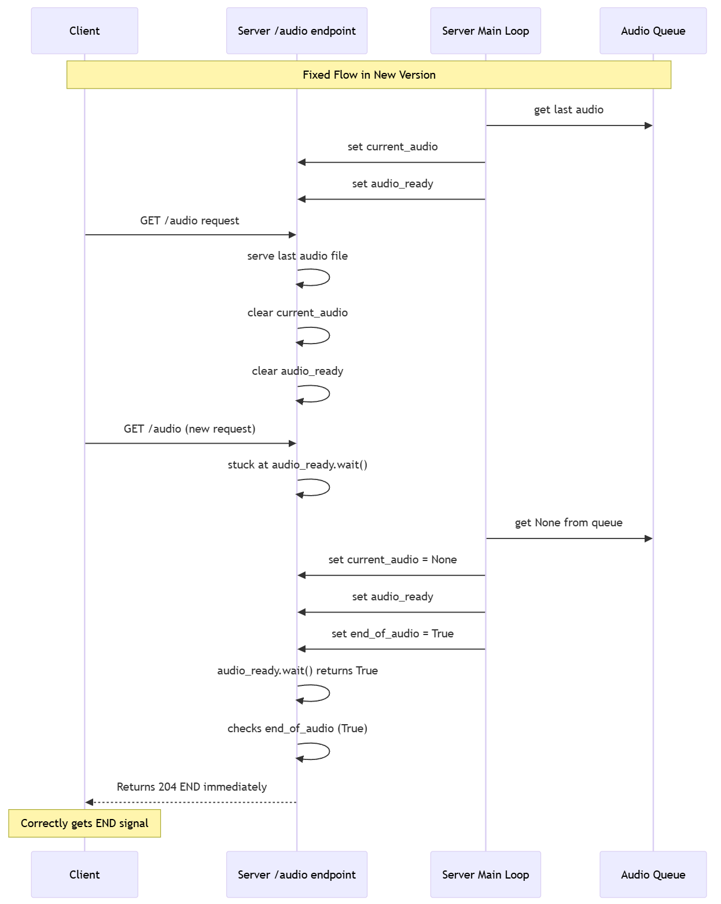

### Update Log for RemoteSpeaker Class

#### Version: New Version

commit ID: a9f9f56894a030928dad4e06b095c88f3a19bd76

**Date**: 2024-11-29
---
#### Summary of Changes

**Reordered Logic in `/audio` Endpoint and Race Condition Fix**:
   - Moved the check for `end_of_audio` to occur after `audio_ready.wait()` returns.
   - Ensures that the client receives a 204 END signal immediately when no more audio is available, rather than waiting for the full timeout period because of the server's processing delay that sets `end_of_audio` to `True` after the client's final request.

#### Diagram of the Race Condition in the Old Version


```
sequenceDiagram
    participant C as Client
    participant SA as Server /audio endpoint
    participant SL as Server Main Loop
    participant Q as Audio Queue

    Note over C,Q: Race Condition Scenario
    
    SL->>Q: get last audio
    SL->>SA: set current_audio
    SL->>SA: set audio_ready
    
    C->>SA: GET /audio request
    SA->>SA: serve last audio file
    SA->>SA: clear current_audio
    SA->>SA: clear audio_ready
    
    Note over C,SA: Critical Race Point
    
    C->>SA: GET /audio (new request)
    SA->>SA: enters serve_audio()
    SA->>SA: stuck at audio_ready.wait(300s)
    
    SL->>Q: get None from queue
    SL->>SA: set end_of_audio = True
    
    Note over C,SA: Client still waiting...
    Note over SA: Can't see end_of_audio=True<br/>because it's waiting on audio_ready
    
    SA-->>C: Returns 404 after 300s timeout
    Note over C: Should have gotten 204 END<br/>but got 404 instead
```

#### Diagram of the Fixed Version


```
sequenceDiagram
    participant C as Client
    participant SA as Server /audio endpoint
    participant SL as Server Main Loop
    participant Q as Audio Queue

    Note over C,Q: Fixed Flow in New Version
    
    SL->>Q: get last audio
    SL->>SA: set current_audio
    SL->>SA: set audio_ready
    
    C->>SA: GET /audio request
    SA->>SA: serve last audio file
    SA->>SA: clear current_audio
    SA->>SA: clear audio_ready
    
    C->>SA: GET /audio (new request)
    SA->>SA: stuck at audio_ready.wait() 

    SL->>Q: get None from queue
    SL->>SA: set current_audio = None
    SL->>SA: set audio_ready
    SL->>SA: set end_of_audio = True
    
    SA->>SA: audio_ready.wait() returns True
    SA->>SA: checks end_of_audio (True)
    SA-->>C: Returns 204 END immediately
    
    Note over C: Correctly gets END signal
```