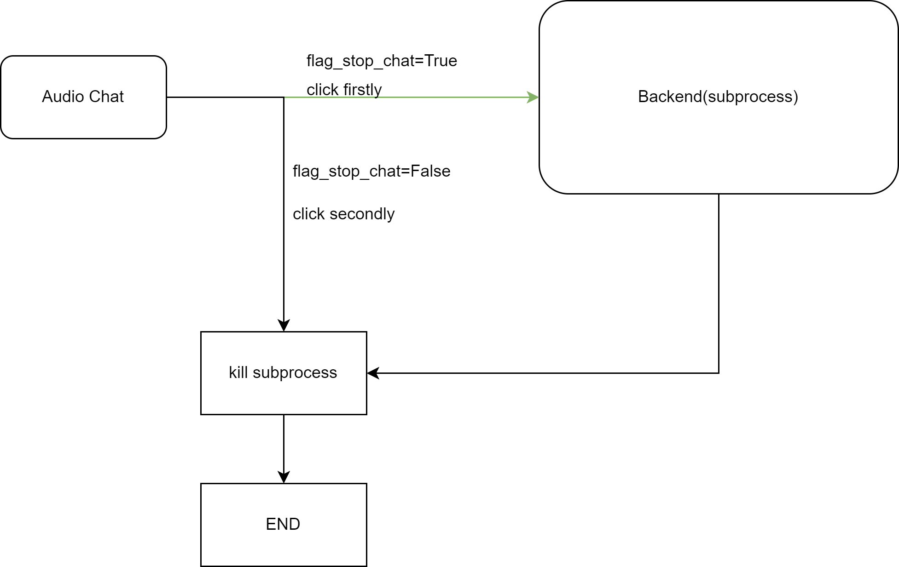

# 前端聊天界面

## 纯文字对话界面
这是一个简约的聊天界面，只包含一个对话框。
用户在输入框中输入文字后，再点击“Enter”按钮，就会触发“Backend”函数，其会接收用户的输入，然后给出相应，最后这个相应会出现在聊天框的左边，而用户输入则会在右边。

## 纯语音对话界面
这个界面将有一个语音交互按钮，用户点击这个按钮，就会触发“Backend”函数，其会接收用户的录音，然后给出回复，最后这个回复会出现在聊天框的左边，用户的输入会被转换成文字，放在右边。另外，“Clear”按钮用于清空聊天框。

### AudioChat按钮触发后端函数后，获得用户语音转录结果以及LLM的response的解决方案。
由于"Backend"的实现是一个线程，具有高封装性，已有的实现没法从一个正在运行的线程中实时获取最新的推理结果，为了能够实时得到最新的LLM推理的token以及STT的结果，这里给出的解决方案为：

- 实时获取LLM推理的token：在后端线程实现里expose一个`response_for_web_display`的队列，如果LLM推理出了一个新的token，就放到这个队列里，如果推理完毕，则放入一个推理结束标志符号。然后在主线程里，设计一个函数，借助上述队列，实现实时返回token。
- 用户语音转文本结果：在后端线程实现里expose一个`stt_for_web_display`的队列，如果STT模块完成了语音转文本，那么就把转录结果放到这个队列里面。

#### 具有内容管控功能的后端
由于具有内容管控功能的后端在输入不合规时，会跳过LLM的推理，这会导致`response_for_web_display`为空，所以我们需要extend这个后端的功能：如果`kwargs`里有`response_for_web_display`，则也把固定回复放到这个队列里。
### 多轮对话实现
当前`Backend`是一个单轮对话API，要实现多轮对话，就需要在死循环里创建`Backend`实例：
- 当一次交互完成时，便会自动创建新的实例。
- 
- 另外，为了提高整体性，我们会把对话封装为一个进程，而当用户再次点击按钮后，则需要停止实例的创建，取消子进程的运行。这可以通过一个flag_stop_chat变量来表示：第一次点击时，flag_stop_chat为False，创建进程，当用户再次点击按钮后，flag_stop_chat为True，取消进程。当对话被封装为一个进程后，我们需要把其暴露出来的`response_for_web_display`和`stt_for_web_display`实现为使用`multiprocessing.Queue`的实现，这样就能够把数据从子进程发送到主进程。
- 